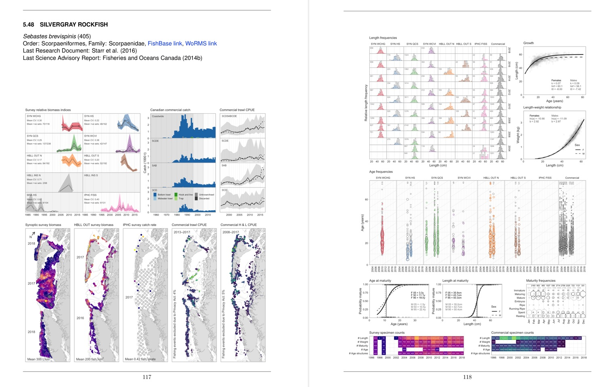

# A reproducible data synopsis report for over 100 species of British Columbia groundfish

-----------------

### Links to the latest published report: **[English](http://www.dfo-mpo.gc.ca/csas-sccs/Publications/ResDocs-DocRech/2019/2019_041-eng.html)** | **[French](http://www.dfo-mpo.gc.ca/csas-sccs/Publications/ResDocs-DocRech/2019/2019_041-fra.html)**

-----------------



This package uses the data extraction, data tidying, model fitting, and plotting functions from [gfplot](https://github.com/pbs-assess/gfplot) and [gfdata](https://github.com/pbs-assess/gfdata).

# Building the document

*The following is for internal use. You need to be on our network to have access to our databases.*

1. Install gfsynopsis and csasdown:

```r
# install.packages("devtools")
devtools::install_github("pbs-assess/gfsynopsis", dependencies = TRUE)
```

2. Clone or download the gfsynopsis GitHub repository.

3. **On the Pacific Biological Station network** and with the R working directory set to the root folder of the project (e.g., open the RStudio `gfsynopsis.Rproj` file), install any missing packages used in `report/make.R` and run:

```r
source("report/make.R")
```

4. Wait for a long time for all the data to download, all the models to fit, and all the plots to generate. If you are starting from scratch then it may take a day or so to download all the data and fit all the spatiotemporal survey models and commercial CPUE index standardization models. If you already have these results cached, then it could take anywhere from ~10 minutes to a couple hours depending what needs to be built.

5. In RStudio, open `gfsynopsis/report/report-rmd/index.Rmd` and click the "Knit" button, or in any R console run:

```r
setwd("report/report-rmd")
bookdown::render_book("index.Rmd")
setwd("../../")
```

Problems? File an [issue](https://github.com/pbs-assess/gfsynopsis/issues).
