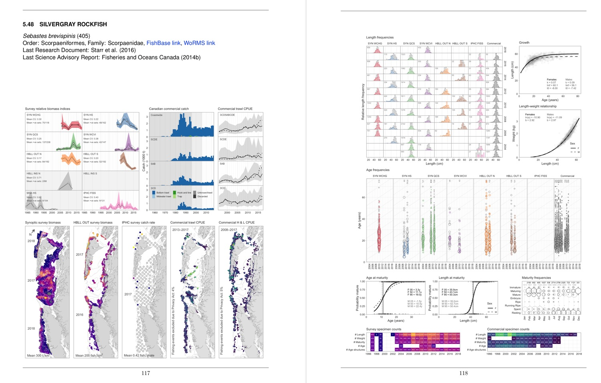

## A reproducible data synopsis report for over 100 species of British Columbia groundfish

### Technical Report (data up to 2024):

**[English](https://doi.org/10.60825/h406-v638)** | **[French](https://doi.org/10.60825/2b8n-my73)**

### Technical Report (data up to 2023):

**[English](https://doi.org/10.60825/aevx-nb49)**

### Technical Report (data up to 2022):

**[English](https://science-catalogue.canada.ca/record=4125206~S6)**

### Science Response (data up to 2021): 

**[English](https://csas-scas.dfo-mpo.gc.ca/publications-publications/7ab04346-6081-478e-b1c9-6711f022d5fe?lang=en)** | **[French](https://csas-scas.dfo-mpo.gc.ca/publications-publications/7ab04346-6081-478e-b1c9-6711f022d5fe?lang=fr)**

### Research Document (data up 2019; includes appendices describing data and methods): 

**[English](https://csas-scas.dfo-mpo.gc.ca/publications-publications/0a09ace0-7249-4c72-be1c-579005135e2a?lang=en)** | **[French](https://csas-scas.dfo-mpo.gc.ca/publications-publications/0a09ace0-7249-4c72-be1c-579005135e2a?lang=fr)**

### Paper on the synopsis report:

Anderson, S.C., E.A. Keppel, A.M. Edwards. 2020. Reproducible visualization of raw fisheries data for 113 species improves transparency, assessment efficiency, and monitoring. Fisheries. 45:535–543. https://doi.org/10.1002/fsh.10441. ([Preprint PDF](https://www.dropbox.com/s/4mmnomvmpg0dbky/Anderson_etal_2020_reproducible_visualization_preprint.pdf?dl=1))

-----------------

This package uses the data extraction, data tidying, model fitting, and plotting functions from [gfplot](https://github.com/pbs-assess/gfplot) and [gfdata](https://github.com/pbs-assess/gfdata).
