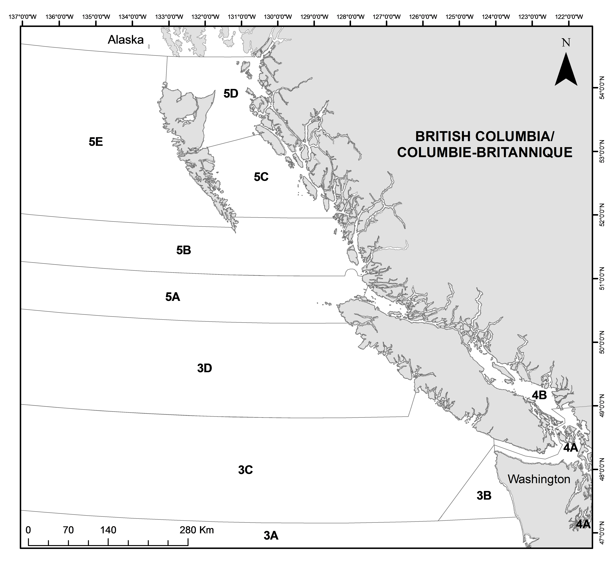

# INTRODUCTION {#sec:intro}

The combination of fishery-dependent data, such as catch and effort, and
fishery-independent survey data, such as biomass indices and age
compositions, form the backbone of most fisheries stock assessment.
Fisheries and Oceans Canada (DFO) at the Pacific Biological Station
(PBS) manages vast quantities of such data on groundfish species in
British Columbia (BC). However, we (DFO Science Branch, Pacific Region
stock assessment scientists) lack the capacity to conduct formal stock
assessments for most stocks annually, and therefore, much of these data
are not regularly published or readily accessible.

As one step to address this issue, we have created this data synopsis
report to give a snapshot of long-term and recent population and fishing
trends, as well as data availability, for all major British Columbia groundfish
stocks of commercial and conservation interest. The report is an
extension of the data scorecard concept discussed at a Canadian Science
Advisory Secretariat (CSAS) Regional Peer Review Meeting in May 2016
[@macdougall2016]. We intend to publish this report as a CSAS Research
Document in its first year and to update the report annually
(excluding any unchanged methods) as a CSAS
Science Response in subsequent years. The report generation is fully
automated --- pulling data from databases, fitting models, generating
visualizations, and stitching the document together to facilitate rapid
publication, reproducibility, and transparency.

Our goals with this report are to (1) facilitate regular review by
groundfish scientists and managers of trends in survey
indices and stock composition across all stocks to potentially flag
stocks for prioritized assessment; (2) generate standardized datasets,
biological model fits, and visualizations that will help assessment
scientists develop operating models and select candidate management
procedures as part of a planned management procedure framework for
data-limited and data-moderate groundfish stocks; and (3) increase data
transparency between Fisheries and Oceans Canada, the fishing industry,
First Nations, non-governmental organizations, and the general public.

## REPORT STRUCTURE

The main results of this synopsis report are presented in two-page
species-by-species subsections that visually synthesize most available data for
each species (Sections\ \@ref(sec:synopsis-plots-A) and
\@ref(sec:synopsis-plots-B)). The report focuses on the 110 species listed in
the current BC groundfish strategic plan, which are divided into those
identified as species of primary commercial or conservation interest ('A-level'
species) followed by 80 'B-level' species. The report focuses on the surveys
and data types applicable to the widest array of these species.
The report excludes two prominent species, Pacific Hake (*Merluccius
productus*) and Pacific Halibut (*Hippoglossus stenolepis*) because they have
their own dedicated surveys and annual stock assessments and are not well
represented by the data visualized in this report [e.g. @edwards2018hake;
@stewart2018halibut].

Each set of pages for a single species is laid out in the same way. A set of
pages starts with the species common name, the species scientific name, and the
DFO species code, which usually corresponds to the page number referencing the
species in @hart1988. The figures themselves are laid out such that the first
page has survey timeseries trends and spatial patterns on the left and
commercial timeseries and spatial patterns on the right. The second page is
focused on biological samples. This page begins at the top with length and age
data and their relationship with each other, then shows data on maturity, and
finishes with an overview of available numbers of sampled fish across all
survey (Figure\ \@ref(fig:intro-maps)) and commercial (Figure
\@ref(fig:management-map)) samples for various biological measurements.

In terms of surveys, we have focused on the Synoptic Bottom Trawl surveys, the
Outside Hard Bottom Long Line surveys (HBLL; alternatively referred to as the
Pacific Halibut Management Association, PHMA, surveys) (Figure
\@ref(fig:intro-maps)), and the International Pacific Halibut Commission (IPHC)
Fishery Independent Setline surveys because these provide the greatest
spatial and taxonomic coverage of the stocks in this report. As an example, we
are not showing biomass index trends or maps from the Sablefish trap surveys,
since these are highly selective for Sablefish. However, we do include counts
of available fish specimens from biological samples on all surveys and fit
biological models such as growth models to all available data. A brief
description of the included surveys is included in Appendix
\@ref(app:survey-trend-models) along with associated references for detailed
survey descriptions and designs.

(ref:intro-maps-cap) Synoptic bottom trawl survey boundaries (left) and Outside
Hard Bottom Long Line survey boundaries (right). The colours matches the colour
coding through the rest of the report. The coverage of the International
Pacific Halibut Commission (IPHC) survey is shown later.

```{r intro-maps, fig.height=2, fig.width=7.9, out.width="\\textwidth", fig.cap="(ref:intro-maps-cap)", fig.pos="tb"}
xlim <- c(122, 890)
ylim <- c(5373, 6027)
bath <- c(100, 200, 500)
utm_zone <- 9
ll_range <- gfplot:::utm2ll(cbind(X = xlim, Y = ylim), utm_zone = 9)
coastline_utm <- gfplot:::load_coastline(
  xlim_ll = ll_range[, "X"] + c(-5, 5),
  ylim_ll = ll_range[, "Y"] + c(-5, 5),
  utm_zone = utm_zone
)
isobath_utm <- gfplot:::load_isobath(
  xlim_ll = ll_range[, "X"] + c(-5, 5),
  ylim_ll = ll_range[, "Y"] + c(-12, 12),
  bath = bath, utm_zone = utm_zone
)

# synoptic surveys -------------------------------------------------------------

hs_utm <- gfplot:::ll2utm(gfplot::survey_boundaries$HS, utm_zone = 9)
qcs_utm <- gfplot:::ll2utm(gfplot::survey_boundaries$QCS, utm_zone = 9)
wcvi_utm <- gfplot:::ll2utm(gfplot::survey_boundaries$WCVI, utm_zone = 9)
wchg_utm <- gfplot:::ll2utm(gfplot::survey_boundaries$WCHG, utm_zone = 9)
ss <- dplyr::bind_rows(
  list(data.frame(hs_utm, survey = "Hecate Strait (HS)", stringsAsFactors = FALSE),
  data.frame(qcs_utm, survey = "Queen Charlotte Strait (QCS)", stringsAsFactors = FALSE),
  data.frame(wcvi_utm, survey = "West Coast Vancouver Island (WCVI)", stringsAsFactors = FALSE),
  data.frame(wchg_utm, survey = "West Coast Haida Gwaii (WCHG)", stringsAsFactors = FALSE)))

g <- ggplot()

cols <- paste0(c(RColorBrewer::brewer.pal(5L, "Set1"),
          RColorBrewer::brewer.pal(8L, "Set1")[7:8],
          "#303030", "#a8a8a8", "#a8a8a8", "#a8a8a8"), "80")
g <- g + geom_polygon(data = ss, aes_string(x = "X", y = "Y", fill = "survey")) +
  scale_fill_manual(values = c(
    "Hecate Strait (HS)" = cols[2],
    "Queen Charlotte Strait (QCS)" = cols[3],
    "West Coast Vancouver Island (WCVI)" = cols[4],
    "West Coast Haida Gwaii (WCHG)" = cols[1]))

g <- g + geom_path(
  data = isobath_utm, aes_string(
    x = "X", y = "Y",
    group = "paste(PID, SID)"
  ),
  inherit.aes = FALSE, lwd = 0.4, col = "grey70", alpha = 0.4
)
g <- g + geom_polygon(
  data = coastline_utm,
  aes_string(x = "X", y = "Y", group = "PID"),
  inherit.aes = FALSE, lwd = 0.2, fill = "grey87", col = "grey70"
) +
  coord_equal(xlim = xlim, ylim = ylim) +
  theme_pbs() + labs(fill = "", colour = "", y = "Northing", x = "Easting")

g <- g + theme(legend.justification = c(0, 0), legend.position = c(0, 0))


# HBLL -------------------------------------------------------------------------

hbll_n <- gfplot:::ll2utm(gfplot::hbll_n_grid$grid, utm_zone = 9)
hbll_s <- gfplot:::ll2utm(gfplot::hbll_s_grid$grid, utm_zone = 9)

hbll <- dplyr::bind_rows(
  list(data.frame(hbll_n, survey = "Outside Hard Bottom Long Line (N)", stringsAsFactors = FALSE),
  data.frame(hbll_s, survey = "Outside Hard Bottom Long Line (S)", stringsAsFactors = FALSE)))

g2 <- ggplot()
g2 <- g2 + geom_rect(data = hbll,
  aes_string(xmax = "X + 1", ymax = "Y + 1", xmin = "X - 1", ymin = "Y - 1", fill = "survey")) +
  scale_fill_manual(values = c(
    "Outside Hard Bottom Long Line (N)" = cols[5],
    "Outside Hard Bottom Long Line (S)" = cols[6])) +
  geom_path(
  data = isobath_utm, aes_string(
    x = "X", y = "Y",
    group = "paste(PID, SID)"
  ),
  inherit.aes = FALSE, lwd = 0.4, col = "grey70", alpha = 0.4
)
g2 <- g2 + geom_polygon(
  data = coastline_utm,
  aes_string(x = "X", y = "Y", group = "PID"),
  inherit.aes = FALSE, lwd = 0.2, fill = "grey87", col = "grey70"
) +
  coord_equal(xlim = xlim, ylim = ylim) +
  theme_pbs() + labs(fill = "", colour = "", y = "Northing", x = "Easting")

g2 <- g2 + theme(legend.justification = c(0, 0), legend.position = c(0, 0))

gridExtra::grid.arrange(g, g2, nrow = 1)
```

```{r management-map, fig.cap="Map of the management areas 5AB (Queen Charlotte Sound), 5CD (Hecate Strait), and 3CD (West Coast Vancouver Island).", out.width="3.3in", fig.pos="tb"}

```

\vspace{0mm}
Following the species-by-species visualizations, we include the following
appendices:

1. Appendix \@ref(app:age-precision) shows ageing precision plots for each
   species.

1. Appendix \@ref(app:depth-curves) shows the predicted relationships between
   depth and synoptic survey biomass density for each species.

1. Appendix \@ref(app:data) provides details on the data extraction from the
   relational databases that hold the raw data.

1. Appendix \@ref(app:cpue-models) provides details on the catch per unit
   effort (CPUE) model that underlies the CPUE visualizations.

1. Appendix \@ref(app:spatial-modeling) provides details on the spatial
   modelling behind the spatial survey biomass visualizations.

1. Appendix \@ref(app:survey-trend-models) provides details on the survey
   biomass index modeling (except for the IPHC survey).

1. Appendix \@ref(app:iphc-survey-index) provides details on the modelling for
   the IPHC survey time series.

1. Appendix \@ref(app:growth-and-maturity) provides details on modelling
   biological parameters.

1. Appendix \@ref(app:reproducibility) provide the details on the computational
   environment and reproducibility of this report.

1. The final section contains the bibliography, including those references
   listed on the figure pages.

In navigating the report, we suggest that the report is best viewed in a PDF
two-page view so that all the plots for a single species can be viewed at once.
We also note that the Table of Contents, index pages, figures, and citations
are clickable hyperlinks to facilitate navigation.

We made a number of overarching design decisions in structuring the
report:

1. Each species is displayed with the same layout to facilitate finding a
type of data, comparing stocks, and identifying missing data via empty
plots.

1. We have limited the report to two pages per species so that all plots
can be laid out at once on a screen in a PDF. The data presentation is
dense, but we believe there is value in being able to examine all the
data for a species at once.

1. The colours representing the various surveys are held constant to
facilitate tracing a single survey throughout the plots.

1. The colour scales are consistent for the survey maps and survey
biological specimen number plots and for the commercial CPUE
maps and commercial biological specimen number plots (the bottom
plots on both pages).

1. Data on female fish are always shown in front of data on male fish and
are either coloured or black whereas males are always indicated with
light grey.

## CAVEATS

There are many caveats when interpreting this report. First, the survey index
trends are not intended to be a substitute for stock assessment. For example,
although relative biomass indices from surveys indicate the biomass trend for
a species in an area, such information is best combined with other information
such as removals by commercial catches and information on the age- or
length-composition of the stock to make conclusions about the status of
a stock. Second, biomass indices from trawl or longline surveys and commercial
CPUE indices need careful interpretation on a stock-by-stock basis. We have
attempted to flag survey index trends that may be especially suspect either
because of high survey variability or because only a small fraction of trawl or
longline sets contain the species, but this is not a guarantee in itself.
Survey indices are not always representative of abundance for a variety of
reasons, and a lack of data for a species does not necessarily indicate a small
population --- the surveys may simply not be suitable for sampling that
species. Furthermore, changes through time, including fish behavioural changes
or range shifts, could result in biases through time even for well-sampled
species.

Commercial CPUE timeseries, even when standardized for consistent time of year,
depth, latitude, and vessel need to be considered even more carefully. There
are a multitude of reasons why commercial CPUE trends may not represent
underlying trends in abundance [e.g. @harley2001]. Nonetheless, we think there
is value in transparently displaying the available data for all species. The
commercial catch presented here may not be the best representation and won't
necessarily match reconstructed timeseries in stock assessments. Historic catch
reconstructions require careful species-specific consideration and analysis.
Furthermore, fluctuations in commercial catch, for example recent declines in
species catch for Bocaccio and Yelloweye Rockfish, do not necessarily reflect
declines in stock abundance and may be due to other factors including
implementation of management measures. The discards in the catch plot do not
include those from the hook-and-line fisheries. Longline discards are
considered less reliable prior to 100% observer coverage in 2006 and are often
reported as discard counts without a reported weight. These discards are
therefore not included in catch shown here.

An overall caveat of this work is that it is not feasible for us to individually
assess the results for all 110 species in a detailed manner. To use the results
for a particular species in future assessments, or to make other inferences, we
recommend that users carefully examine the data and model results. Due to the
necessary automation required to construct this report, not all
species-specific special cases may have have been fully considered.

<!--
We developed the gfplot R package to conduct all the data extraction, data
manipulation, model fitting, and plotting in the data synopsis report. The
package is designed to be modular so it can be used in various capacities for
other groundfish analyses (Figure \@ref(fig:gfplot-web)). For example, the
package is intended to facilitate pulling data directly into analyses for the
forthcoming management procedure framework for data-limited and data-moderate
groundfish stocks. TODO a few more details on the utility of this.
-->

## UPDATE SCHEDULE

We intend to publish annual updates of this synopsis report as Science
Response documents. These annual updates will include another year of
data and any important corrections to the data, text, or visualizations.
On a less frequent basis we will consider making larger changes to the
structure, methods or content of the report. We will consider these larger
possible revisions approximately every three years.

## ACKNOWLEDGEMENTS

We are grateful for the ongoing collaboration between DFO, commercial fishers,
First Nations, and non-governmental organizations, which has made possible the
collection of the valuable data that underlies this report. We thank
the project's steering committee (Greg Workman, Robyn Forrest, Dana Haggarty,
Chris Grandin, and Rob Kronlund) for invaluable input into the report design
and feedback throughout its production. We thank Christie Whelan for her
support initiating this project. We thank Norm Olsen, Maria Surry, and Malcolm
Wyeth for providing support on data extraction and general database structure
and content. We thank the participants of the peer review meeting on tiered
approaches in May 2016 [@macdougall2016], which included a data scorecard by
Norm Olsen, from which this report takes inspiration. We also thank Norm Olsen
for his work on GFASTeR, which this project also takes inspiration from and
borrows some of the data queries. We thank Rowan Haigh for his work maintaining
the PBSmapping and PBSdata R packages, and indeed the authors of all the R
packages necessary to build this report.
